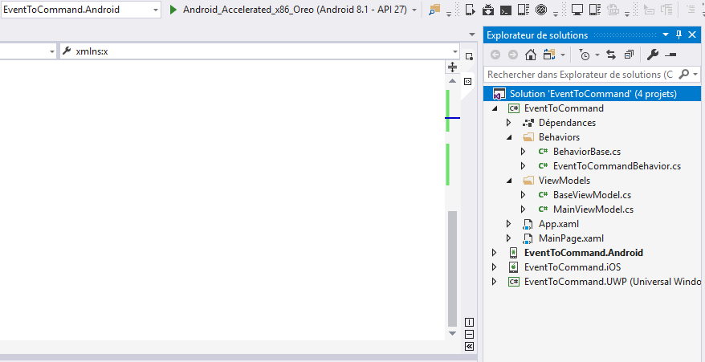

#  Event to command Behavior

In this article, let’s explore a Xamarin.Forms feature called *behaviors*, which in the context of *commanding*, enables any Xamarin.Forms control to use data bindings to make method calls to a ViewModel.

## Create your project


## Project structure



## Introduction to Behaviors

Behaviors let you add functionality to UI controls without having to  subclass them. Instead, the functionality is implemented in a behavior  class and attached to the control as if it was part of the control  itself. Behaviors enable you to implement code that you would normally  have to write as code-behind because it directly interacts with the API  of the control in such a way that it can be concisely attached to the  control and packaged for reuse across more than one app. They can be  used to provide a full range of functionality to controls, from adding  an email validator to a `Entry` to creating a rating control using a tap gesture recognizer.

### Implementing a Behavior

The procedure for implementing a behavior is as follows:

1. Inherit from the `Behavior<T>` class, where `T` is the type of control that the behavior should apply to.
2. Override the `OnAttachedTo` method and use it to perform any set up.
3. Override the `OnDetachingFrom` method to perform any clean up.
4. Implement the core functionality of the behavior.

This results in the structure shown in the following code example:

```csharp
using System;
using Xamarin.Forms;

namespace EventToCommand.Behaviors
{
    public class BehaviorBase<T> : Behavior<T> where T : BindableObject
    {
        public T AssociatedObject { get; private set; }

        protected override void OnAttachedTo(T bindable)
        {
            base.OnAttachedTo(bindable);
            AssociatedObject = bindable;

            if (bindable.BindingContext != null)
            {
                BindingContext = bindable.BindingContext;
            }

            bindable.BindingContextChanged += OnBindingContextChanged;
        }

        protected override void OnDetachingFrom(T bindable)
        {
            base.OnDetachingFrom(bindable);
            bindable.BindingContextChanged -= OnBindingContextChanged;
            AssociatedObject = null;
        }

        void OnBindingContextChanged(object sender, EventArgs e)
        {
            OnBindingContextChanged();
        }

        protected override void OnBindingContextChanged()
        {
            base.OnBindingContextChanged();
            BindingContext = AssociatedObject.BindingContext;
        }
    }
}

```

## Invoking a Command in Response to an Event

### Implementing Bindable Properties

```csharp
using System;
using System.Reflection;
using System.Windows.Input;
using Xamarin.Forms;

namespace EventToCommand.Behaviors
{
    public class EventToCommandBehavior: BehaviorBase<View>
    {
        Delegate eventHandler;

        public static readonly BindableProperty EventNameProperty = BindableProperty.Create("EventName", typeof(string), typeof(EventToCommandBehavior), null, propertyChanged: OnEventNameChanged);
        public static readonly BindableProperty CommandProperty = BindableProperty.Create("Command", typeof(ICommand), typeof(EventToCommandBehavior), null);
        public static readonly BindableProperty CommandParameterProperty = BindableProperty.Create("CommandParameter", typeof(object), typeof(EventToCommandBehavior), null);
        public static readonly BindableProperty InputConverterProperty = BindableProperty.Create("Converter", typeof(IValueConverter), typeof(EventToCommandBehavior), null);

        public string EventName
        {
            get { return (string)GetValue(EventNameProperty); }
            set { SetValue(EventNameProperty, value); }
        }

        public ICommand Command
        {
            get { return (ICommand)GetValue(CommandProperty); }
            set { SetValue(CommandProperty, value); }
        }

        public object CommandParameter
        {
            get { return GetValue(CommandParameterProperty); }
            set { SetValue(CommandParameterProperty, value); }
        }

        public IValueConverter Converter
        {
            get { return (IValueConverter)GetValue(InputConverterProperty); }
            set { SetValue(InputConverterProperty, value); }
        }

        protected override void OnAttachedTo(View bindable)
        {
            base.OnAttachedTo(bindable);
            RegisterEvent(EventName);
        }

        protected override void OnDetachingFrom(View bindable)
        {
            base.OnDetachingFrom(bindable);
            DeregisterEvent(EventName);
        }

        void RegisterEvent(string name)
        {
            if (string.IsNullOrWhiteSpace(name))
            {
                return;
            }

            EventInfo eventInfo = AssociatedObject.GetType().GetRuntimeEvent(name);
            if (eventInfo == null)
            {
                throw new ArgumentException(string.Format("EventToCommandBehavior: Can't register the '{0}' event.", EventName));
            }
            MethodInfo methodInfo = typeof(EventToCommandBehavior).GetTypeInfo().GetDeclaredMethod("OnEvent");
            eventHandler = methodInfo.CreateDelegate(eventInfo.EventHandlerType, this);
            eventInfo.AddEventHandler(AssociatedObject, eventHandler);
        }

        void DeregisterEvent(string name)
        {
            if (string.IsNullOrWhiteSpace(name))
            {
                return;
            }

            if (eventHandler == null)
            {
                return;
            }
            EventInfo eventInfo = AssociatedObject.GetType().GetRuntimeEvent(name);
            if (eventInfo == null)
            {
                throw new ArgumentException(string.Format("EventToCommandBehavior: Can't de-register the '{0}' event.", EventName));
            }
            eventInfo.RemoveEventHandler(AssociatedObject, eventHandler);
            eventHandler = null;
        }

        void OnEvent(object sender, object eventArgs)
        {
            if (Command == null)
            {
                return;
            }

            object resolvedParameter;
            if (CommandParameter != null)
            {
                resolvedParameter = CommandParameter;
            }
            else if (Converter != null)
            {
                resolvedParameter = Converter.Convert(eventArgs, typeof(object), null, null);
            }
            else
            {
                resolvedParameter = eventArgs;
            }

            if (Command.CanExecute(resolvedParameter))
            {
                Command.Execute(resolvedParameter);
            }
        }

        static void OnEventNameChanged(BindableObject bindable, object oldValue, object newValue)
        {
            var behavior = (EventToCommandBehavior)bindable;
            if (behavior.AssociatedObject == null)
            {
                return;
            }

            string oldEventName = (string)oldValue;
            string newEventName = (string)newValue;

            behavior.DeregisterEvent(oldEventName);
            behavior.RegisterEvent(newEventName);
        }
    }
}

```

### Consuming the Behavior

```xaml
<?xml version="1.0" encoding="utf-8" ?>
<ContentPage
    x:Class="EventToCommand.MainPage"
    xmlns="http://xamarin.com/schemas/2014/forms"
    xmlns:x="http://schemas.microsoft.com/winfx/2009/xaml"
    xmlns:behaviors="clr-namespace:EventToCommand.Behaviors">

    <StackLayout
        HorizontalOptions="Center"
        Orientation="Horizontal"
        VerticalOptions="Center">
        <Entry Placeholder="Enter text" VerticalOptions="Center">
            <Entry.Behaviors>
                <behaviors:EventToCommandBehavior Command="{Binding EntryFocusedCommand}" EventName="Focused" />
                <behaviors:EventToCommandBehavior Command="{Binding EntryTextChangedCommand}" EventName="TextChanged" />
            </Entry.Behaviors>
        </Entry>
    </StackLayout>

</ContentPage>

```

### ViewModel

```csharp
using System.Windows.Input;
using Xamarin.Forms;

namespace EventToCommand.ViewModels
{
    public class MainViewModel : BaseViewModel
    {
        public ICommand EntryFocusedCommand { get; private set; }
        public ICommand EntryTextChangedCommand { get; private set; }

        public MainViewModel()
        {
            EntryFocusedCommand = new Command(FocusedAlert);
            EntryTextChangedCommand = new Command(TextChangedAlert);
        }


        private void FocusedAlert()
        {
            // Do action
        }

        private void TextChangedAlert()
        {
           // Do action
        }
    }
}

```

